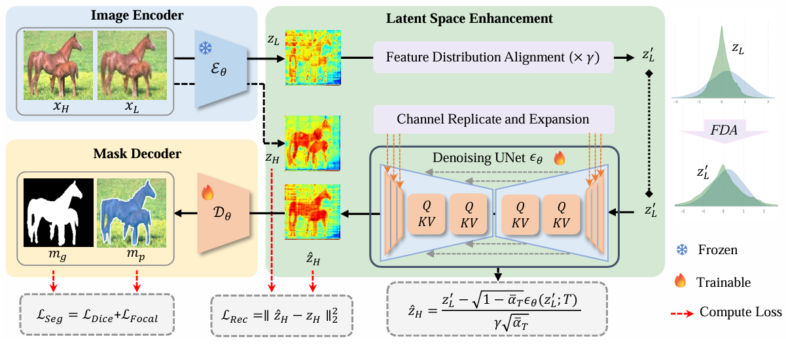
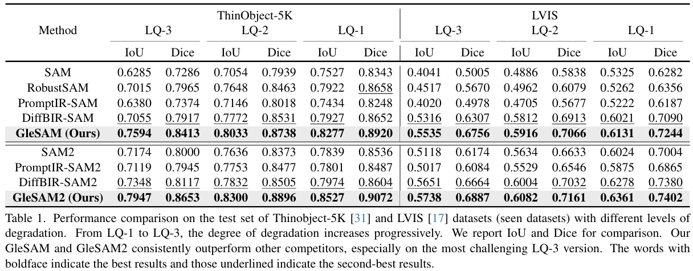
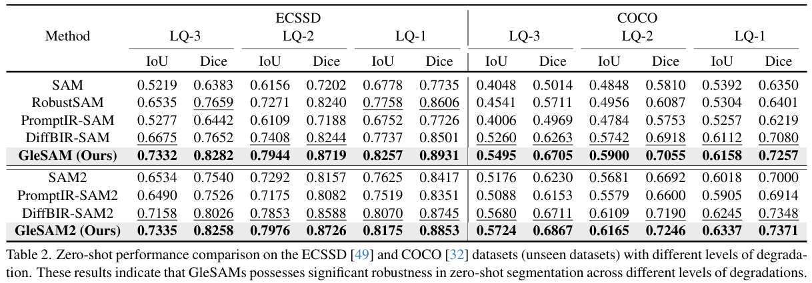
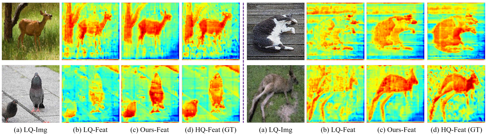
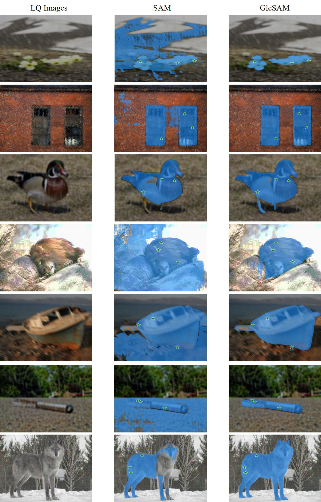
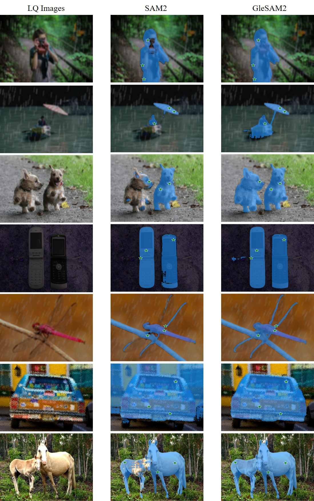

<p align="center">
    
</p>


# [CVPR2025] Segment Any-Quality Images with Generative Latent Space Enhancement

<div align="center">
<a href="https://guangqian-guo.github.io/">Guangqian Guo</a><sup><span>1</span></sup>, 
<a href="http://www.guoyongcs.com/">Yong Guo</a><sup><span>2</span></sup>,
<a>Xuehui Yu</a><sup><span>3</span></sup>,
<a>Wenbo Li</a><sup><span>4</span></sup>,
<a>Yaoxing Wang</a><sup><span>1</span></sup>,
<a>Shan Gao</a><sup><span>1</span></sup>,
<br>
<sup>1</sup> Northwestern Polytechnical University <sup>2</sup> Huawei <sup>3</sup> University of Chinese Academy of Sciences
<sup>4</sup> Huawei Noah’s Ark Lab <br>
    </div>


 <a href='https://arxiv.org/abs/2503.12507'></a> <a href=''></a> <a href=''></a>


**Improving SAM's robustness to low-quality images using generative Diffusion.**

> **Abstract:** Despite their success, Segment Anything Models (SAMs) experience significant performance drops on severely degraded, low-quality images, limiting their effectiveness in real-world scenarios. To address this, we propose GleSAM, which utilizes Generative Latent space Enhancement to boost robustness on low-quality images, thus enabling generalization across various image qualities. Specifically, we adapt the concept of latent diffusion to SAM-based segmentation frameworks and perform the generative diffusion process in the latent space of SAM to reconstruct high-quality representation, thereby improving segmentation. Additionally, we introduce two techniques to improve compatibility between the pre-trained diffusion model and the segmentation framework. Our method can be applied to pre-trained SAM and SAM2 with only minimal additional learnable parameters, allowing for efficient optimization. We also construct the LQSeg dataset with a greater diversity of degradation types and levels for training and evaluating the model. Extensive experiments demonstrate that GleSAM significantly improves segmentation robustness on complex degradations while maintaining generalization to clear images. Furthermore, GleSAM also performs well on unseen degradations, underscoring the versatility of our approach and dataset.

<p align="center">
    
</p>

⭐If this work is helpful for you, please help star this repo. Thanks!🤗


## 📑 Contents

- **[Update](#🔥 Update)**
- **[Todo](Todo List)**
- **[Results](# 🥇 Results of GleSAM)**
- **[Model](Model Summary)**
- **[Environment](# 📷 Environment Setup)**
- **[LQSeg dataset](# 💡 LQSeg Dataset)**
- **[Train](# 📈 Train)**
- **[Evaluation](# 📈 Evaluation)**
- **[Citation](#citation)**


## 🔥 Update

- **[05/26/2025]🔥We release the [code](https://github.com/guangqian-guo/GleSAM), [models](https://github.com/guangqian-guo/GleSAM), and [data](https://github.com/guangqian-guo/GleSAM) for GleSAM!**
- **[04/04/2025]🔥We release the [paper](https://arxiv.org/abs/2503.12507) for GleSAM!**
- **[03/01/2025]🔥Congratulations! Our GleSAM is accepted by CVPR 2025!**


## Todo List

- [x] Release training & evaluation code.

- [x] Release LQSeg dataset.

- [x] Release trained models.


## 🥇 Results of GleSAM

<details>
<summary>Evaluation on Seen dataset (click to expand)</summary>
<p align="center">
  
</p>
</details>

<details>
<summary>Evaluation on UnSeen dataset (click to expand)</summary>
<p align="center">
  
</p>
</details>

<details>
<summary>Feature visualization (click to expand)</summary>
<p align="center">
  
</p>
</details>
<details>
<summary>Visual Results (click to expand)</summary>
<p align="center">
  
  
</p>
</details>


## :page_with_curl: Model Summary

You can download the trained models from [this link (extract code: hnj2)](https://pan.baidu.com/s/19bPHc-izizzFQykX5UbrHA).


## 📷 Environment Setup

Please follow the instructions below to install the required packages.


1. Clone this repository

```bash
https://github.com/guangqian-guo/GleSAM.git
```

2. Install Package

```bash
conda create -n glesam python=3.10
conda activate glesam
pip install -r requirements.txt
```

3. Download the necessary pretrained models
   - SAM: https://github.com/facebookresearch/segment-anything
   - Stable Diffusion 
     - SD 2.1-base: https://huggingface.co/stabilityai/stable-diffusion-2-1/tree/main
     - SD 1.5: https://huggingface.co/stable-diffusion-v1-5/stable-diffusion-v1-5
   - optional (the following models are used for text prompt):
     - DAPE: https://github.com/cswry/SeeSR/tree/main
     - RAM:  https://github.com/xinyu1205/recognize-anything
     - BERT: https://huggingface.co/google-bert/bert-base-uncased/tree/main


## 💡 LQSeg Dataset

We construct a comprehensive low-quality image segmentation dataset dubbed ***LQSeg*** that encompasses more complex and multi-level degradations, rather than relying on a single type of degradation for each image. The dataset is composed of images from several existing datasets with our synthesized degradations. Specifically, the degraded process is modeled as the random combination of the four common degradation models, including ***Blur***, ***Random Resize***, ***Noise***, and ***JPEG Compression***. To enrich the granularity of degradation, we employ multi-level degradation by adjusting the downsampling rates. We employed three different resize rates, *i.e.*, [1, 2, 4], which correspond to three degradation levels from slight to severe: **LQ-1**, **LQ-2**, and **LQ-3**.  More details are shown in [this file](degraded_utils/README).


## 📈 Train

GleSAM training consists of two stages: 

- **Finetuning the denoising U-Net**
- **Finetuning SAM's decoder**

### Step 1: Fine-tuning U-Net

```bash
# full precision
bash  train_scripts/train_glesam_denoising_unet_multi_dataset.sh  {feature weight}  {work-dir}

# fp16
bash  train_scripts/train_glesam_denoising_unet_multi_dataset_fp16.sh  {feature weight}  {work-dir}

# example
bash  train_scripts/train_glesam_denoising_unet_multi_dataset_fp16.sh  5  work-dir/test
```

### Step 2： Fine-tuning Decoder

```bash
bash  train_scripts/train_glesam_decoder_multi_dataset.sh   {feature weight}   {work-dir}   {unet-lora-path}

# example
bash  train_scripts/train_glesam_decoder_multi_dataset.sh   5   work-dir/   pytorch_lora_weights.safetensors
```

Our model is trained on 4x 40G A100 GPUs.

If you want to save video memory, you can use fp16 fine-tuning.


## 📈 Evaluation

```bash
bash  train_scripts/train_glesam_decoder_multi_dataset.sh   {feature weight}   {work-dir}   {unet-lora-path}  --eval

# example
bash  train_scripts/train_glesam_decoder_multi_dataset.sh   5   work-dir/   pytorch_lora_weights.safetensors  --eval
```


## Citation

If you find this repo useful for your research, please consider citing the paper

```
@article{guo2025segment,
  title={Segment Any-Quality Images with Generative Latent Space Enhancement},
  author={Guo, Guangqian and Guo, Yong and Yu, Xuehui and Li, Wenbo and Wang, Yaoxing and Gao, Shan},
  journal={arXiv preprint arXiv:2503.12507},
  year={2025}
}
```


## Acknowledgement

We would like to thank the following repos for their great work:

- This work uses segmentation models from [Segment-Anything](https://github.com/facebookresearch/segment-anything).


## License

This project is released under the [Apache 2.0 license](https://github.com/RainBowLuoCS/DEEM/blob/main/LICENSE). Parts of this project contain code and models from other sources, which are subject to their respective licenses.

