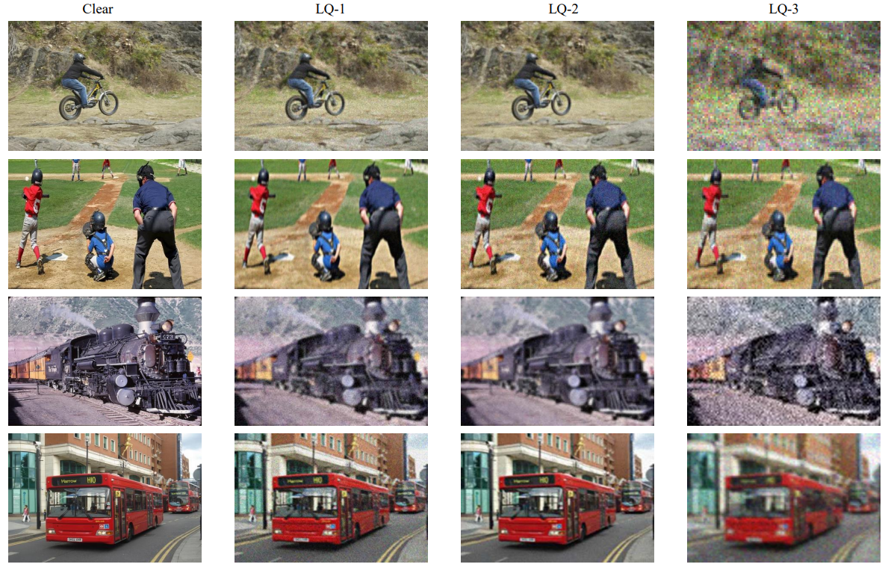

# LQSeg Dataset

We construct a comprehensive low-quality image segmentation dataset dubbed ***LQSeg*** that encompasses more complex and multi-level degradations, rather than relying on a single type of degradation for each image. The dataset is composed of images from several existing datasets with our synthesized degradations. Specifically, the degraded process is modeled as the random combination of the four common degradation models, including ***Blur***, ***Random Resize***, ***Noise***, and ***JPEG Compression***. To enrich the granularity of degradation, we employ multi-level degradation by adjusting the downsampling rates. We employed three different resize rates, *i.e.*, [1, 2, 4], which correspond to three degradation levels from slight to severe: **LQ-1**, **LQ-2**, and **LQ-3**. 

## Dataset Composition
The datasets we used include: Thinobject-5K-train, MSRA, LVIS-train for training; ECSSD, COCO, LVIS-test, Thinobject-5K-test for testing.

You can download the clear images from [Baidu Netdisk (53eh)](https://pan.baidu.com/s/126I9wnqDp6UWyZw09nacaw).

```bash
datas
	train
		Thinobject-5K
		MSRA
		LVIS
	test_clear
		COCO
		ECSSD
		LVIS
		Thinobject-5K
```


## Multi-level Degradation Modeling

Based on the above clear images, we synthesize the corresponding degraded data.

For the training set, the degradation process is performed online during training.

For the test set, the test set is degraded offline.

By modifying "--sf", each data set synthesizes three different degraded datasets.

```bash
# example
python utils_data/make_paired_data_guo.py  --gt_path {dir for the clear dataset path}  --save_dir {dir for the save path}  --epoch 1  --sf 2
```


## Image Examples

<p align="center">
  
</p>


